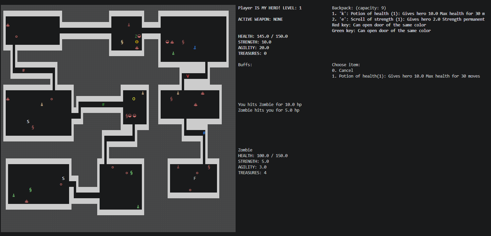

# Rogue
Игра "Rogue" на языке Go.

### Логика игры
- Игра содержит 21 уровень с подземельями.
- Каждый уровень подземелья состоит из 9 комнат, соединенных коридорами.
- В каждой комнате могут находиться противники и предметы.
- Игрок управляет перемещением персонажа, может взаимодействовать с предметами и сражается с противниками.
- Цель игрока — найти на каждом уровне переход на следующий уровень и, таким образом, пройти 21 уровень.
- С каждым новым уровнем повышается количество и сложность противников, снижается количество полезных предметов и повышается количество сокровищ, которые выпадают с побежденных противников.

### Логика персонажа
- Характеристика здоровья персонажа показывает его текущий уровень здоровья.
- Характеристика максимального уровня здоровья показывает максимальный уровень здоровья персонажа, который может быть восстановлен путем употребления еды.
- Характеристика ловкости участвовует в формуле вычисления вероятности попадания противников по персонажу и персонажа по противникам.
- Характеристика силы определяет урон, наносимый персонажем и противниками.
- За победу над противником персонаж получает количество сокровищ, зависящее от сложности противника.
- Персонаж может поднимать предметы и складывать в свой рюкзак, а затем использовать их.
- Каждый предмет при использовании может временно или постоянно изменять одну из характеристик персонажа.
- Достигнув выхода из уровня, персонаж автоматически попадает на следующий уровень.

### Логика противников
- Каждый противник имеет аналогичные игроку характеристики здоровья, ловкости и силы, дополнительно к этому имеет характеристику враждебности.
- Характеристика враждебности определяет расстояние, с которого противник начинает преследовать игрока.
- 5 видов противников: 
  + Зомби (отображение: зеленый z): низкая ловкость; средняя сила, враждебность; высокое здоровье. 
  + Вампир (отображение: красная v): высокая ловкость, враждебность и здоровье; средняя сила. Отнимает некоторое количество максимального уровня здоровья игроку при успешной атаке. Первый удар по вампиру — всегда промах. 
  + Привидение (отображение: белый g): высокая ловкость; низкая сила, враждебность и здоровье. Постоянно телепортируется по комнате и периодически становится невидимым, пока игрок не вступил в бой. 
  + Огр (отображение: желтый O): ходит по комнате на две клетки. Очень высокая сила и здоровье, но после каждой атаки отдыхает один ход, затем гарантированно контратакует; низкая ловкость; средняя враждебность.
  + Змей-маг (отображение: белая s): очень высокая ловкость. Ходит по карте по диагонали, постоянно меняя сторону. У каждой успешной атаки есть вероятность «усыпить» игрока на один ход. Высокая враждебность.

### Логика окружения
- Каждый тип предмета имеет свое значение:
  + сокровища (имеют стоимость, накапливаются и влияют на итоговый рейтинг, можно получить только при победе над монстром);
  + еда (восстанавливает здоровье на некоторую величину);
  + эликсиры (временно повышают одну из характеристик: ловкость, силу, максимальное здоровье);
  + свитки (постоянно повышают одну из характеристик: ловкость, силу, максимальное здоровье);
  + оружие (имеют характеристику силы).
- Рюкзак хранит в себе все типы предметов.
- Когда персонаж наступает на предмет, он автоматически должен добавляться в рюкзак, если он неполон.
- Еда, эликсиры, свитки при использовании тратятся.
 
### Управление
- Управление персонажем:
  + Передвижение при помощи клавиш WASD.
  + Применение оружия из рюкзака при помощи кнопки h.
  + Применение еды из рюкзака при помощи кнопки j.
  + Применение эликсира из рюкзака при помощи кнопки k.
  + Применение свитка из рюкзака при помощи e.
- Любое использование чего-либо из рюкзака приводит к печати списка предметов этого типа на экран с вопросом игроку, что нужно выбрать (1–9).

### Статистика
- В игре собирается и отображается в отдельном представлении статистика всех прохождений, отсортированная по количеству набранных сокровищ: количество сокровищ, достигнутый уровень, количество побежденных противников, количество съеденной еды, количество выпитых эликсиров, количество прочитанных свитков, количество нанесенных и пропущенных ударов, количество пройденных клеток.
